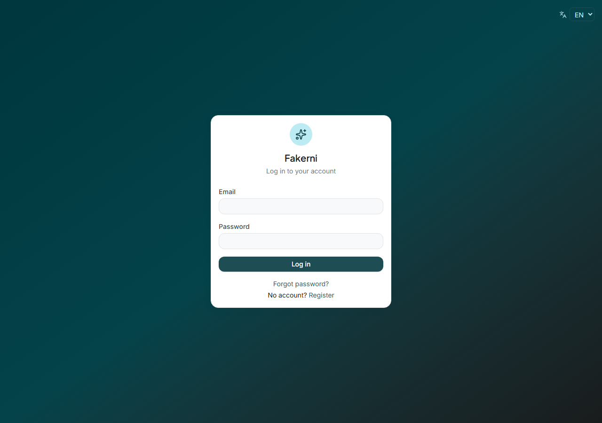
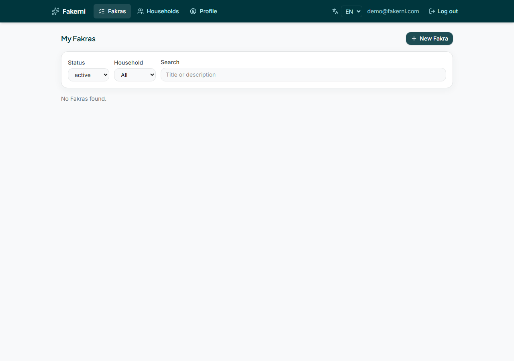
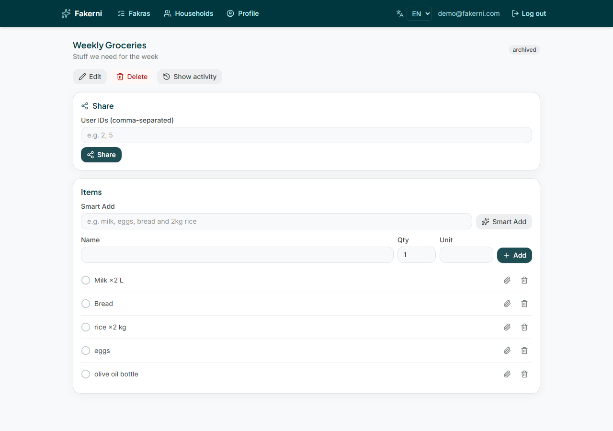
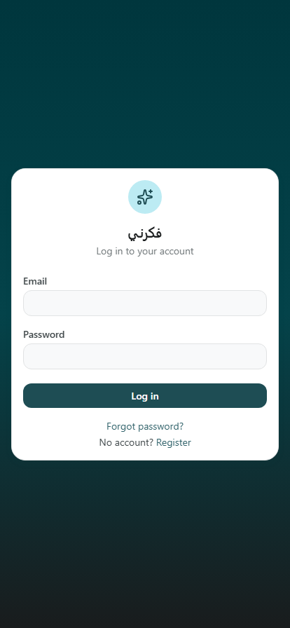
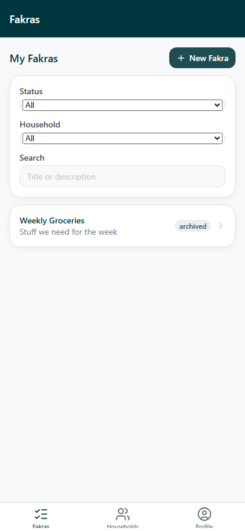
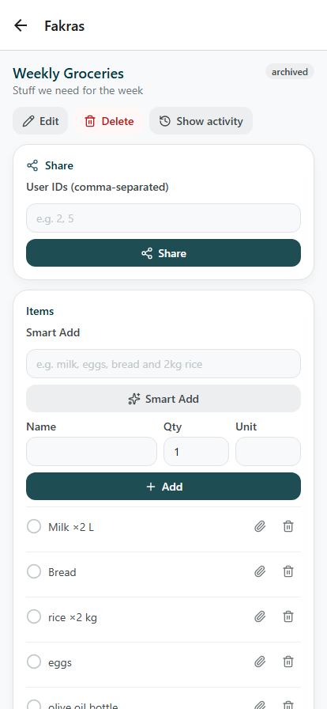
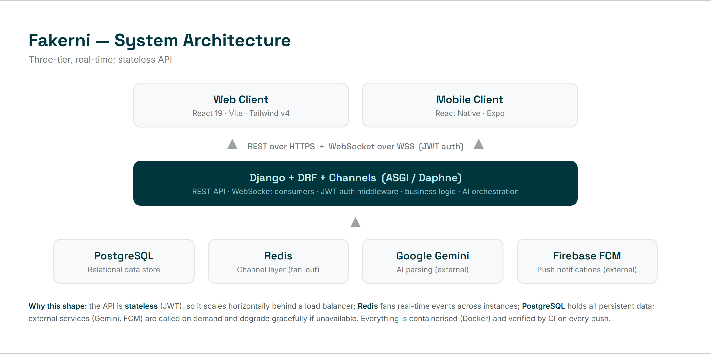
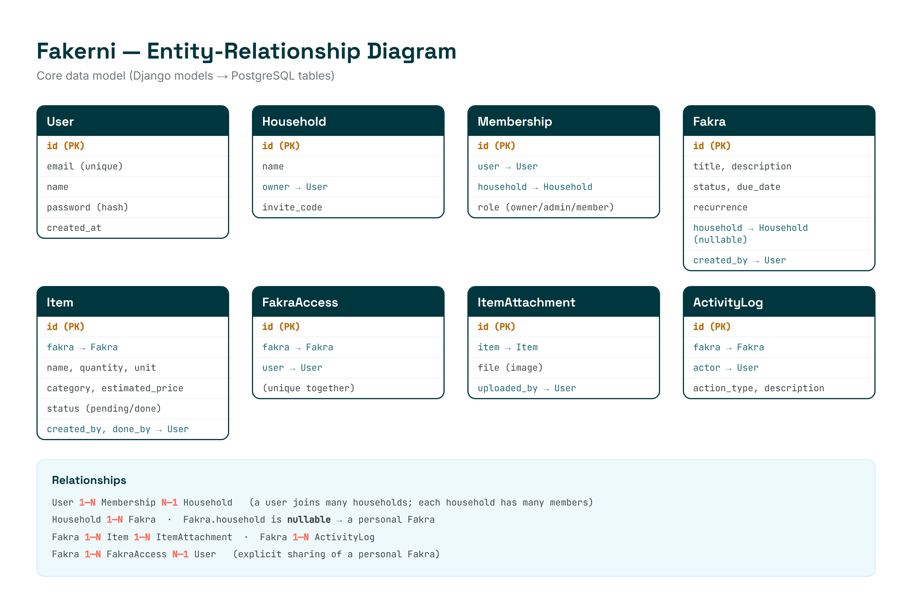

# Fakerni — Smart Shopping & Task Coordination

**Fakerni** (Arabic *فكّرني*, "remind me") is a full-stack platform where a
**group** — a family, a community, an organization, or a society — shares live
lists of things to buy or do. Any member can add items and mark them done, and
everyone sees the change **in real time**, on both **web and mobile**. It goes
beyond a normal to-do app with **AI** (photograph a receipt or type a sentence
and it fills the list), **budgets & analytics**, and **push notifications** —
fully **trilingual** (Arabic, French, English).

> A "Fakra" (*فكرة*, "idea") is one shared list. A "Group" (internally a
> *Household*) is the set of people who share it, with roles and invite codes.

---

## Screens

| Login | Dashboard | List detail |
|---|---|---|
|  |  |  |

Mobile (same backend, native camera/biometrics):

| Mobile login | Mobile dashboard | Mobile detail |
|---|---|---|
|  |  |  |

---

## Architecture



Three-tier, real-time, stateless API:

- **Backend** — Django + Django REST Framework + **Django Channels** (WebSockets),
  served by Daphne (ASGI). PostgreSQL for data, Redis for the real-time channel
  layer (in-memory fallback for single-instance dev). JWT authentication.
- **Web** — React 19 + Vite + Tailwind CSS v4.
- **Mobile** — React Native + Expo (a near-direct port of the web app's logic).
- **External services** — Google **Gemini** for AI parsing, Firebase **FCM** for
  push notifications. Both degrade gracefully if not configured.

### Data model



A **Fakra** belongs to a group *or* is personal (its group link is nullable).
Access to a Fakra is granted three ways — you created it, you're in its group,
or it was explicitly shared with you — all enforced by one central
authorization module (`fakras/permissions.py`).

---

## Features

| Area | What it does |
|---|---|
| **Accounts** | Email/JWT login, password reset via email OTP, profile, biometric app-lock (mobile) |
| **Groups** | Types (family / community / organization / society), invite codes, roles (owner / admin / member), member management |
| **Fakras** | Personal / shared / recurring lists, archive, duplicate, search & filter |
| **Items** | Add / edit, Done & Undo (10-min window), quantity, unit, category, price, photo attachments |
| **Roles & permissions** | Centralized per-action policy; the API returns each caller's allowed actions so the UI hides what they can't do |
| **AI (Gemini)** | Smart Add (text → items), Smart Scan (receipt photo → items + prices), Suggestions, natural-language Commands |
| **Budgets & analytics** | Per-Fakra budget with a progress bar & over-budget alert; spending analytics by month / category / **member**, with time-range filters |
| **Spend intelligence** | Predictive restock ("time to restock milk?"), price-anomaly warnings ("usually ~2.5, this is 40% higher") |
| **Real-time** | Live sync across group, per-list, and per-user channels |
| **Notifications** | Push for new items, completions, members, due-date reminders, budget alerts |
| **Exports** | CSV (both platforms), server-generated PDF |
| **Extras** | Barcode scanning (mobile), dark mode (web), i18n EN / FR / AR with RTL |

---

## Repository structure

```
fakerni/
├── fakerni/          # Django project (settings, ASGI, routing, WebSocket auth)
├── users/            # Accounts, JWT, OTP, device tokens, per-user realtime
├── household/        # Groups, memberships, roles, invites
├── fakras/           # Lists, items, AI (ai.py), permissions, insights, realtime
├── web/              # React + Vite web app
├── mobile/           # Expo / React Native app
├── deck/             # Presentation decks, diagrams (source + rendered)
├── PROJECT_REPORT.md # Full development report (all phases)
├── DEFENSE_KIT.md    # Defense Q&A + demo script
├── DEPLOY_RENDER.md  # One-click live-deploy guide
└── render.yaml       # Render.com deployment blueprint
```

---

## Running it locally

**Prerequisites:** Python 3.13, Node 20+, PostgreSQL (or use the bundled SQLite
for a quick start), and a `.env` (copy `.env.example` → `.env`).

```bash
# 1. Backend  (from the repo root)
pip install -r requirements.txt
python manage.py migrate
python manage.py runserver          # http://localhost:8000  (API + WebSockets)

# 2. Web app
cd web && npm install && npm run dev # http://localhost:5173

# 3. Mobile app (browser preview)
cd mobile && npm install && npx expo start --web   # http://localhost:8081
```

**API documentation** (with the server running): Swagger UI at
`http://localhost:8000/api/docs/`, Redoc at `/api/redoc/`.

**Demo login:** `demo@fakerni.com` / `demo1234`.

---

## Testing

```bash
# Backend — 143 automated tests
python manage.py test users household fakras

# Web — unit tests
cd web && npm run test
```

Continuous integration (GitHub Actions, `.github/workflows/ci.yml`) runs the
full backend suite against a PostgreSQL service plus the web tests and build on
every push.

---

## Deployment

The app is containerized (`Dockerfile`, `docker-compose.yml`) and includes a
one-click **Render.com** blueprint (`render.yaml`). See
[`DEPLOY_RENDER.md`](DEPLOY_RENDER.md) for the full guide.

---

## Documentation

- [`PROJECT_REPORT.md`](PROJECT_REPORT.md) — complete development report, phase by phase.
- [`DEFENSE_KIT.md`](DEFENSE_KIT.md) — defense preparation: architecture, anticipated questions & answers, demo script.
- [`DEPLOY_RENDER.md`](DEPLOY_RENDER.md) — how to deploy it live.
